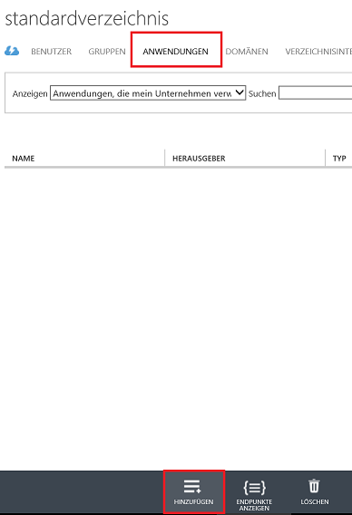
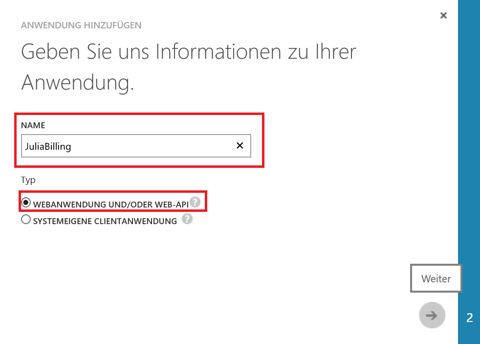
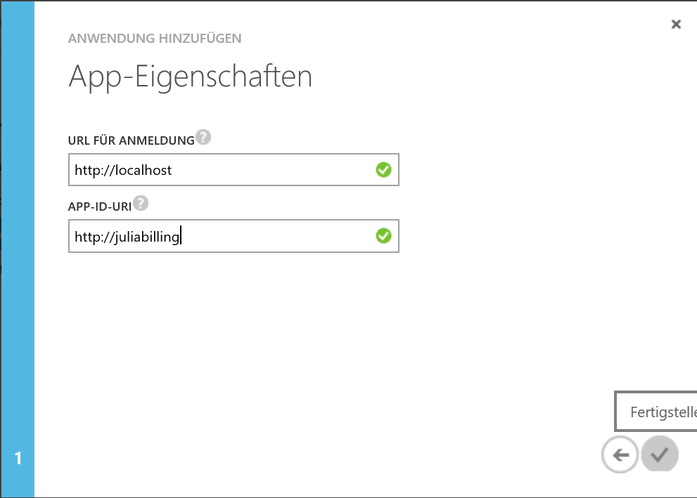
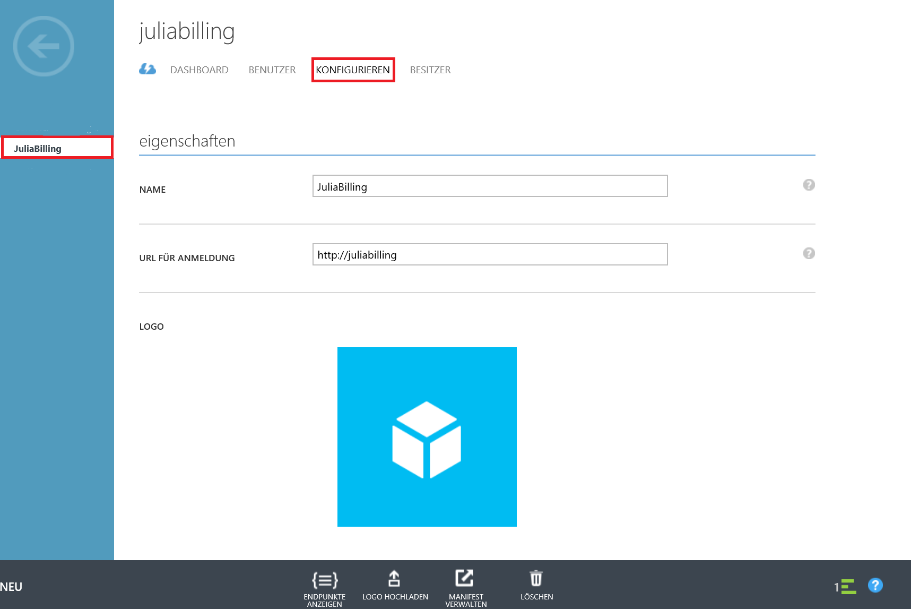
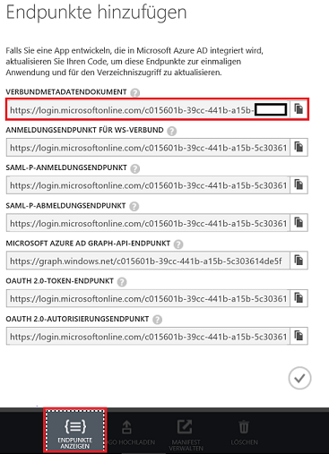
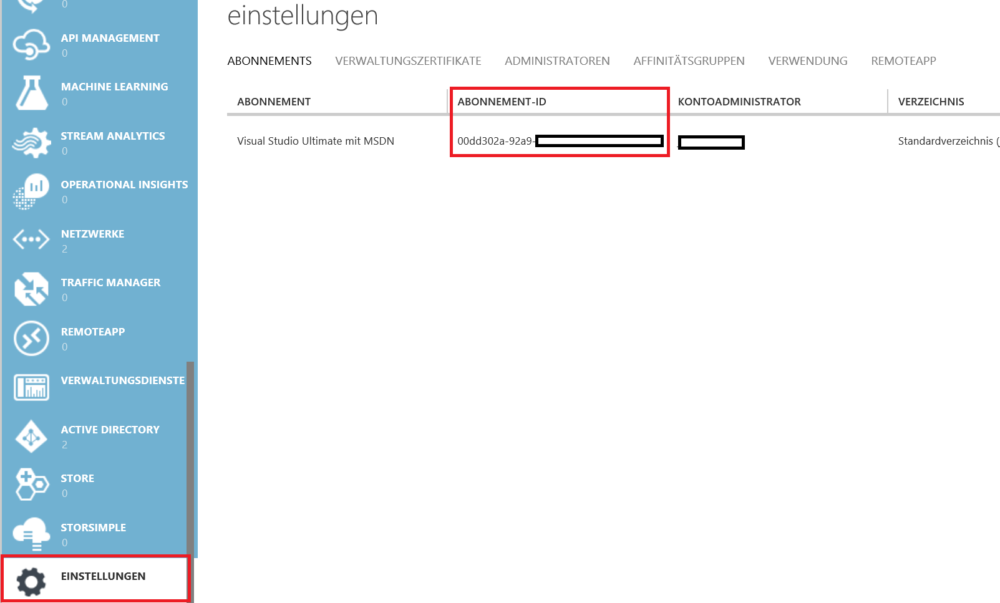

Automatisiertes Abrufen von Billing Informationen mit einer Client Applikation durch Authentifizierung mit Service Principal und Zertifikat 
=======================================================================================

Dieses Codebeispiel ermöglicht Ihnen das automatische Erstellen von Billing Reports. 
Diese Anleitung fokusiert sich auf die Erstellung einer Client Applikation, die sich mit Hilfe eines Service Principals und eines Zertifikates automatisiert authentifiziert.   

Um dieses Beispiel auszuführen, benötigen Sie:

* Visual Studio 2015
* Visual Studio Developer Eingabeaufforderung
* Die makecert.exe vom Windows SDK
* Azure AD Modul für Powershell
* Eine Internetverbindung
* Eine Azure Subscription

Folgende Schritte müssen ausgeführt werden: 

* Download des GitHub Projekts
* [Erstellen einer Azure AD Web Applikation](#aad-app)
* [Zuweisen der gesamten Subscription zum Service Principal](#sp)
* [Erstellen eines Zertifikats](#create-cert)
* [Setzen des Zertifikats als Schlüssel/Passwort für die Billing Applikation](#set-up-cert)
* [Hinzufügen des Zertifikats zum lokalen Zertifikatspeicher](#add-cert)
* [Anpassen der Projekt Konfiguration](#app-config)

## Erstellen einer Azure AD Web Applikation

1. Melden Sie sich im [Azure-Portal](https://manage.windowsazure.com/) an.

1. Klicken Sie auf **Active Directory** und wählen Sie Ihr **Standardverzeichnis**.  

    

1. Klicken Sie in Ihrem Standardverzeichnis auf **Andwendungen** und anschließend auf **Hinzufügen**.

	

1. Geben Sie Ihrer Applikation einen Namen, z.B. **JuliaBilling** und wählen **Web Applikation und/oder Web API** obwohl es sich um eine Client Applikation handelt. 

	

1. Wählen Sie eine Sign-On URL und eine App-Id-URI (diese Parameter müssen später in die Konfiguration des Visual Studio Projekts übertragen werden!).

	

	_Fertigstellung der Azure AD Applikation_

1. Wählen Sie Ihre eben erstellte Anwendungen und klicken auf **Konfigurieren**.

	

1. Folgende Daten (Client Id, Tenant Id, Subscription Id) sind für nachfolgende Konfigurationen notwendig: 

	

1. Klicken Sie auf **Endpunkte anzeigen** und kopieren Sie eine beliebige Zeile. Die Tenant-Id können Sie extrahieren: https://login.microsoftonline.com/ **<Ihre-Tenant-ID>** / 

	

1. Klicken Sie auf **Einstellungen** und notieren Sie die Subscription ID von der Subscription, die mit dem AD verknüpft ist, für welches Sie die Anwendung hinzugefügt haben.

    

1. Sie sollten nun folgende Daten notiert haben:

    **Client Id:** 5f2cf9ad-ceeb-4c98-****-************

    **Tenant Id:** c015601b-39cc-441b-a15b-************

    **Subscription Id:** 00dd302a-92a9-****-****-************

## Zuweisen der gesamten Subscription zum Service Principal

1. Öffnen Sie Azure Powershell als Administrator.

1. Melden Sie sich in Azure mit Ihrer Microsoft Identität an um Ihrem Service Principal Rollen oder das Abonement zuzuweisen.

	>  Login-AzureRmAccount # This will pop up a login dialog
    
1. So gewähren Sie dem Service Principal Zugriff zur kompletten Subscription:

    > Select-AzureRmSubscription -SubscriptionId <subscription-id>

1. Stellen Sie eine Verbindung mit Azure AD her. Für weitere Informationen: https://technet.microsoft.com/library/jj151815.aspx
    > connect-msolservice

1. Erstellen Sie einen neuen Service Principal:
    > New-AzureRmADServicePrincipal -ApplicationId "<your-client-Id>"
    >  New-AzureRmRoleAssignment -ServicePrincipalName "<your-client-Id>" -RoleDefinitionName Contributor

1. Mit dem Befehl **Get-AzureRoleAssignment** können Sie überprüfen, ob die Zuweisung erfolgreich war.

## Erstellen eines Zertifikats

1. Öffnen Sie die Visual Studio Developer Command Prompt (Eingabeaufforderung) als Administrator. 
   (Tipp: Drücken Sie die Windows Taste und suchen nach „dev“)  

1. Tippen Sie folgende Zeile um ein Zertifikat zu erstellen. Merken Sie sich den Speicherort des Zertifikats.
    
    > makecert -r -pe -n "CN=SPBilling" -ss My -len 2048 “C:\SPBilling.cer“

## Setzen des Zertifikats als Schlüssel/Passwort für die Billing Applikation

1. Erstellen Sie ein neues X509 Zertifikat Objekt:
    > $cer = New-Object System.Security.Cryptography.X509Certificates.X509Certificate

2. Importieren Sie das vorher erstellte Zertifikat:
    > $cer.Import("<Path to Certificate (.cer) file created in prior step>")
    >In diesem Beispiel:  $cer.Import("C:\SPBilling.cer”)

3. Speichern Sie die Rohdaten des Zertifikates:
    > $binCert = $cer.GetRawCertData()

4. Und konvertieren Sie die Rohdaten von 8-Bit-Ganzzahlen ohne Vorzeichen in die entsprechende mit Base-64-Ziffern codierte Zeichenfolgendarstellung:
    > $credValue = [System.Convert]::ToBase64String($binCert)

## Hinzufügen des Zertifikats zum lokalen Zertifikatspeicher

1.	Suchen Sie den Thumbprint Ihres eben erstellten Zertifikats:
    > dir Cert:\LocalMachine\My

	

2.	Fügen Sie das Zertifikat dem Trusted Root Store hinzu
    > $cert = (get-item cert:\LocalMachine\My\A70E0D9E39C32B482E8A8D7776462A9470DEF441)
    > $store = (get-item cert:\Localmachine\Root)
    > $store.Open("ReadWrite")
    > $store.Add($cert)
    > $store.Close()

3.	Überprüfen Sie, ob das Zertifikat hinzugefügt wurde:
    > dir Cert:\LocalMachine\Root

## Anpassen der Projekt Konfiguration 

1.	Öffnen Sie die .vsln Datei in Visual Studio und öffnen Sie die app.config Datei.

2. Ersetzen Sie die gegebenen Parameter durch Ihre eigenen, die Sie im Schritt [Erstellen einer Azure AD Web Applikation](#aad-app) konfiguriert haben. 

1. Öffnen Sie die **Program.cs** Projektdatei und 
3. Starten Sie das Projekt. 
